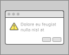
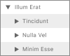
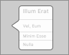
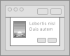

# 可视化索引
大多数 macOS 应用程序都是使用 [AppKit](https://developer.apple.com/documentation/appkit/) 中的组件构建的， AppKit 是一个定义通用界面元素的编程框架。该框架使应用程序在整个系统中实现统一的视觉外观，同时允许高度可定制化。以下的 AppKit 元素灵活且熟悉，还能在系统外观改变时自动更新。

- [窗口和视图](#窗口和视图)
- [菜单](#菜单)
- [按钮](#按钮)
- [框和标签](#框和标签)
- [选择器](#选择器)
- [指示器](#指示器)
- [触控栏控件和视图](#触控栏控件和视图)

除了定义 macOS 的界面外，AppKit 还明确了应用程序可以使用的功能。例如，通过此框架，您的应用可以响应触控板上的手势，并启用绘图，辅助功能和打印等功能。 macOS 与其他编程框架和技术紧密集成，如 GameKit，Metal，SceneKit 和 SpriteKit，使您能够设计出功能非常强大的应用程序。

## 窗口和视图
窗口包括一个或多个视图，其包含人们在屏幕上看到的内容，包括文本，图形，动画和交互元素。

### 警告提示
显示模态消息，错误或警告。

### 框
形成控件，文本字段和其他界面元素的独特逻辑分组。

### 列视图
通过一系列垂直列的导航来展现数据层次结构。

### 图像视图
在透明或不透明背景上显示单个图像或动画图像序列。

### 大纲视图
在列和行的单元格组织中滚动列表来显示分层数据。

### 面板（HUD 式）
在高度可视化或沉浸式应用程序中，来显示与活动文档和选择相关的控件，选项或信息。

### 面板（标准）
显示与活动文档或选择相关的控件，选项或信息。

### 气泡弹出框
单击控件或视图时，在屏幕上显示其他内容上方的控件，选项或信息。

### 滚动视图
通过水平和垂直滚动，可以浏览大于可见区域的内容。

### 片模态对话框
显示附加到窗口的模态对话框中的控件，选项或信息。

