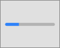

# 可视化索引
大多数 macOS 应用程序都是使用 [AppKit](https://developer.apple.com/documentation/appkit/) 中的组件构建的， AppKit 是一个定义通用界面元素的编程框架。该框架使应用程序在整个系统中实现统一的视觉外观，同时允许高度可定制化。以下的 AppKit 元素灵活且熟悉，还能在系统外观改变时自动更新。

- [窗口和视图](#窗口和视图)
- [菜单](#菜单)
- [按钮](#按钮)
- [框和标签](#框和标签)
- [选择器](#选择器)
- [指示器](#指示器)
- [触控栏控件和视图](#触控栏控件和视图)

除了定义 macOS 的界面外，AppKit 还明确了应用程序可以使用的功能。例如，通过此框架，您的应用可以响应触控板上的手势，并启用绘图，辅助功能和打印等功能。 macOS 与其他编程框架和技术紧密集成，如 GameKit，Metal，SceneKit 和 SpriteKit，使您能够设计出功能非常强大的应用程序。

## 窗口和视图
窗口包括一个或多个视图，其包含人们在屏幕上看到的内容，包括文本，图形，动画和交互元素。

### 警告提示
显示模态消息，错误或警告。

### 框
形成控件，文本字段和其他界面元素的独特逻辑分组。

### 列视图
通过一系列垂直列的导航来展现数据层次结构。

### 图像视图
在透明或不透明背景上显示单个图像或动画图像序列。

### 大纲视图
在列和行的单元格组织中滚动列表来显示分层数据。

### 面板（HUD 式）
在高度可视化或沉浸式应用程序中，来显示与活动文档和选择相关的控件，选项或信息。

### 面板（标准）
显示与活动文档或选择相关的控件，选项或信息。

### 气泡弹出框
单击控件或视图时，在屏幕上显示其他内容上方的控件，选项或信息。

### 滚动视图
通过水平和垂直滚动，可以浏览大于可见区域的内容。

### 片模态对话框
显示附加到窗口的模态对话框中的控件，选项或信息。

### 侧边栏
出现在窗口的一侧。允许导航和选择要在窗口主要部分中执行的项目。

### 拆分视图
管理两个或多个内容面板的呈现。

### 标签视图
在同一区域中呈现多个互斥的内容面板。

### 表格视图
按列表和行组织的单元格滚动列表中显示数据。

### 工具栏
提供对应用程序窗口中常用命令和功能的快速访问。

### 网页视图
加载并显示丰富的 Web 内容，例如嵌入式 HTML 和网站。

### 窗口
由框架区域和正文区域组成，可以查看应用程序中的内容并与之交互。

## 菜单
菜单显示选项列表，例如命令，属性或状态。

### 上下文菜单
通过按住 Control 键单击项目显示。提供对与当前上下文相关的常用命令的访问。

### 程序坞菜单
通过按住 Control 键单击应用程序的图标显示。提供系统范围内的可用命令的访问。

### 菜单栏菜单
当应用程序窗口位于最顶层时，提供对特定于应用程序的命令的菜单栏访问。

## 按钮
按钮启动操作或允许人们做出选择。

### 动作按钮
通常位于工具栏或表格下方。展开应用程序范围内或特定于表格的命令。类似于上下文菜单。

### 复选框
提供两种相反状态，操作或值之间的选择。

### 展开按钮
显示和隐藏与特定控件关联的功能，如“保存”对话框中的“另存为”文本字段。

### 展开三角形
显示和隐藏与视图或可公开项目列表相关的信息或功能。

### 梯度按钮
启动与特定视图相关的立即操作，例如添加或删除表行。

### 帮助按钮
在系统提供的帮助查看器中打开特定于应用程序的帮助文档。

### 图像按钮
包含图像或图标，并启动即时的应用程序特定操作。

### 弹出按钮
显示包含互斥选项列表的菜单。

### 下拉按钮
显示命令列表或启用一个或多个状态的选择。

### 按钮
包含标题并启动即时特定于应用程序的操作。

### 单选按钮
提供一组两个或更多相互排斥但相关的选项。

### 范围按钮
限制视图中的内容范围，例如搜索结果。

## 框和标签
框和标签显示静态或可编辑的信息。 

### 组合框 
在单个控件中将文本字段与下拉按钮组合在一起。

### 标签
描述屏幕界面元素或提供短消息。

### 搜索框
在大量数据中启用基于文本的搜索。

### 文本框
允许用户输入和编辑一行或多行文本。

### 令牌框
允许用户输入和编辑令牌，可以轻松选择和操作的文本块。

## 选择器
选择器允许人们选择特定值，如颜色，日期或文件。

### 颜色槽
使用系统的颜色面板启用颜色选择。

### 日期选择器
允许文本或图形选择日期，时间，日期和时间或一系列日期。

### 图像槽
可编辑的图像视图预览。支持拖放，删除，复制和粘贴。

### 路径控件
显示所选文件或文件夹的文件系统路径。

### 分段控件
两个或多个段的水平集合，用作按钮或进行切换并影响到对象，状态或视图。

### 滑块
水平轨道，垂直轨道或圆形控制器。在一系列值中启用细粒度的选择。

### 步进器
增量或减少数字，日期或时间值。

## 指示器 
指示器以图形方式传达级别或状态信息。

### 容量指示器（连续）
跟踪与有限容量相关的当前级别并图形化填充。

### 容量指示器（离散）
填充的矩形段，用于说明与有限容量相关的当前级别。

### 进度条
填充以显示已知持续时间的任务进度的条形图。

### 进度环
填充的圆圈，用于显示已知持续时间的任务的进度。

### 加载圈
为无法预估的任务，如加载或同步复杂数据，启用动画效果。

### 评级指示器
使用一系列水平排列的图形符号来传达排名级别

### 关联指示器
使用一系列垂直条来传达相关性。

## 触控栏控件和视图
这些界面元素使您的应用可以在 macOS 触控栏中显示内容并响应用户交互。

### 按钮
点击时启动特定于应用的操作。也可以作为切换操作。

### 候选列表
在文本输入期间提供自动完成建议。

### 符号选择器
打开包含表情符号等特殊字符列表的弹出窗口。

### 颜色选择器
打开包含用于选择颜色的控件的弹出框。

### 弹出控件
显示为按钮。点击时，显示包含了一组临时的模态控件。

### 滑动条（固定）
允许向左和向右滑动以流畅地浏览一组排列的内容，例如打开 Safari 选项卡。

### 滑动条（自由）
允许向左和向右滑动以浏览可自由滚动列表中的内容，例如日历日期列表。

### 分段控件
两个或多个段的水平集合，用作按钮或切换并影响对象，状态或视图。

### 分享服务选择器
显示包含用于与应用，社交媒体帐户和其他服务分享内容的按钮的弹出窗口。

### 滑块
水平轨道，垂直轨道或圆形控制器。在一系列值中启用细粒度选择。

